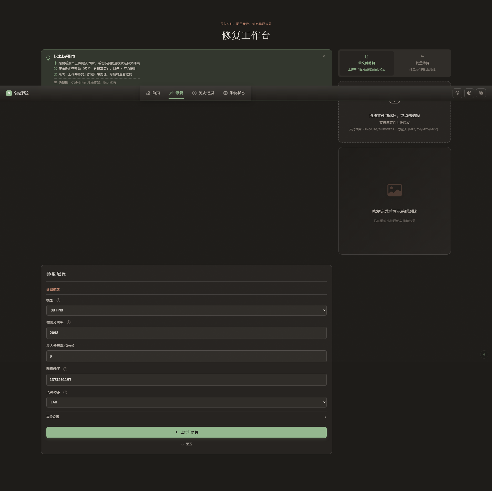
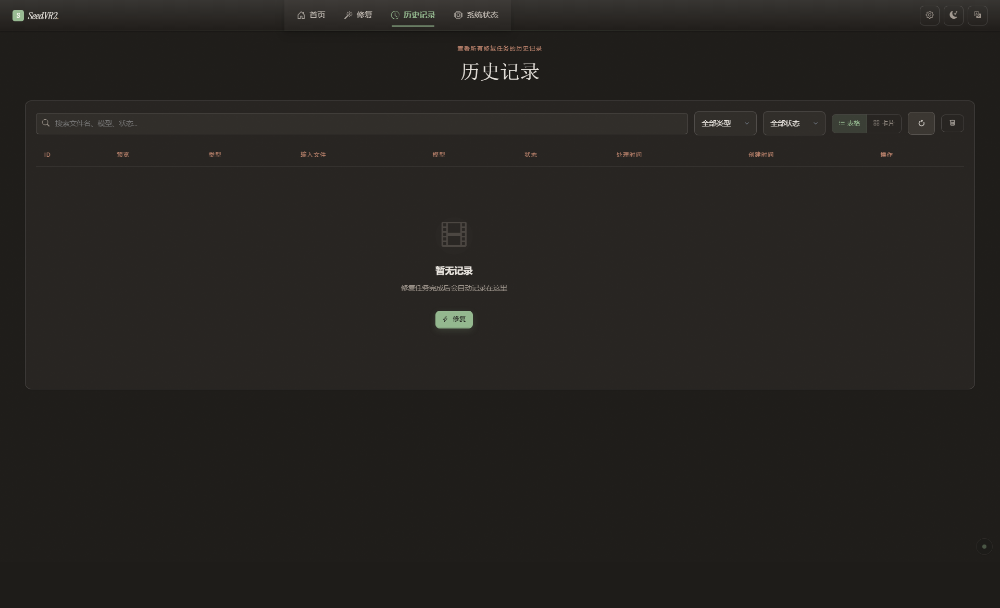
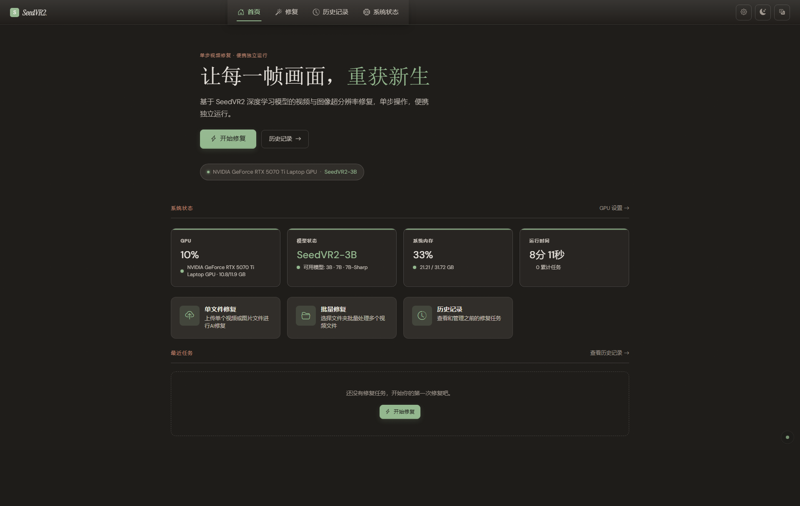
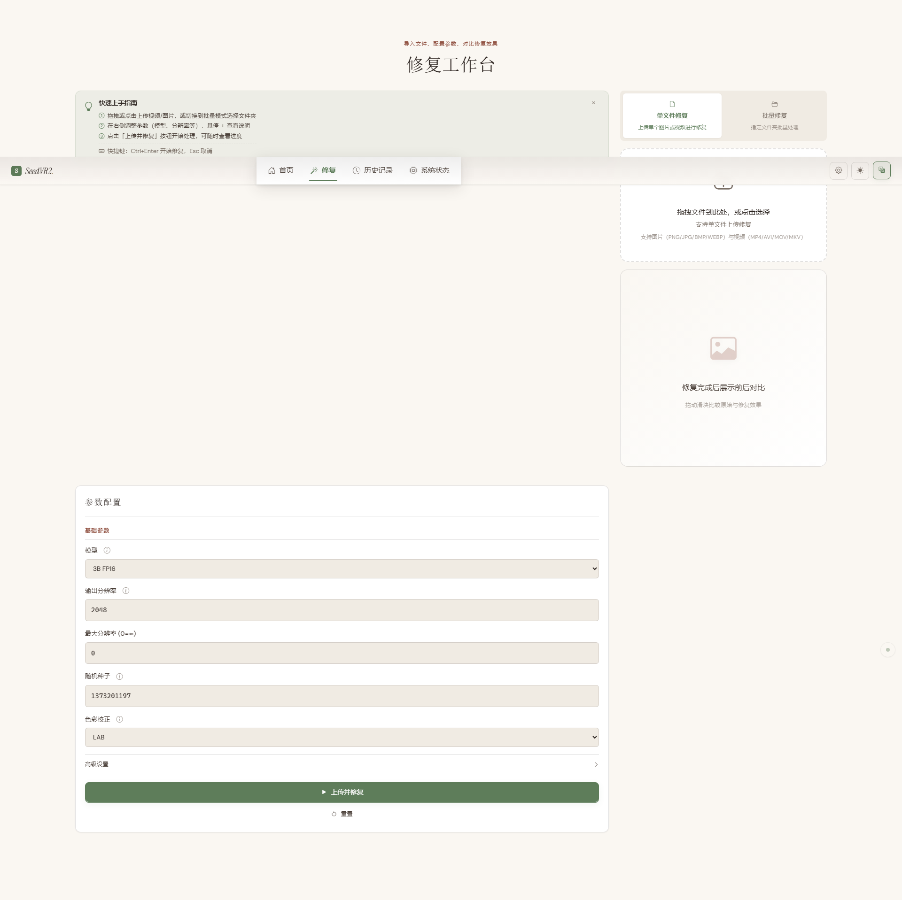
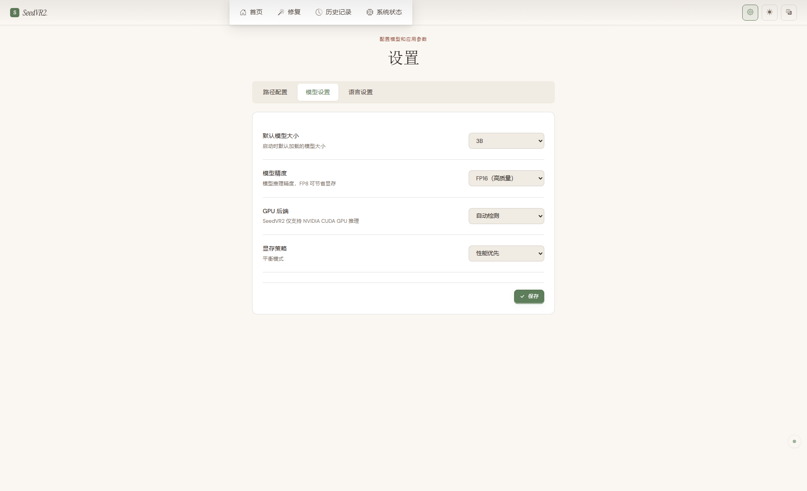

# SeedVR2

    

**基于 SeedVR2 扩散模型的视频与图像超分辨率修复工具箱 — 独立运行的 Web UI，一键修复，无需 ComfyUI**

> **SeedVR2** — A standalone video & image super-resolution toolkit powered by SeedVR2 diffusion models. One-click restoration via Web UI, no ComfyUI dependency required.

---

## 界面预览

*深色主题 — 首页仪表盘 / 修复工作台 / 历史记录 / 系统状态*








*浅色主题 — 首页仪表盘 / 修复工作台 / 模型设置 / 多语言切换*







---

## 技术特点

| 特性 | 说明 |
|---|---|
| **单步扩散修复** | 基于扩散模型的单步推理，高效完成视频与图像的超分辨率修复 |
| **独立运行** | 脱离 ComfyUI，通过 FastAPI + Jinja2 提供完整 Web UI |
| **多模型配置** | 支持 3B、7B、7B-Sharp 三种模型，含 FP16 与 FP8 精度 |
| **DiT 架构** | MM-DiT（多模态 Diffusion Transformer），配合 Window Attention 与 RoPE 位置编码 |
| **Video VAE** | 基于 SD3 架构的视频 VAE，支持时间分块与内存优化 |
| **GPU Block Swap** | 推理时 GPU/CPU 间动态换入换出 Transformer 块，大幅降低显存需求 |
| **批量处理** | 支持单文件上传修复和文件夹批量扫描修复 |
| **多语言界面** | 内置中文、繁体中文、英文、日文、法文五种语言 |
| **实时监控** | GPU 状态、系统内存、任务进度的实时 SSE 推送 |

---

## 安装与使用

### 环境要求

| 项目 | 要求 |
|---|---|
| **操作系统** | Windows（推荐） |
| **GPU** | NVIDIA CUDA GPU（**必须**，不支持 CPU 推理） |
| **Python** | 项目内置 WinPython 3.12（位于 `WPy64-312101/`），无需系统 Python |

#### 显存需求

| 模型 | 精度 | 最低显存 |
|---|---|---|
| SeedVR2-3B | FP16 | 16 GB |
| SeedVR2-3B | FP8 | 8 GB |
| SeedVR2-7B | FP16 | 24 GB |
| SeedVR2-7B | FP8 | 12 GB |
| SeedVR2-7B-Sharp | FP16 | 24 GB |
| SeedVR2-7B-Sharp | FP8 | 12 GB |

### 快速启动

1. 下载并解压 [WinPython 3.12](https://github.com/winpython/winpython/releases) 到项目根目录，确保 `WPy64-312101/python/python.exe` 存在
2. 将预训练模型放入 `pretrained_models/` 目录
3. 双击运行：

```bat
start.bat
```

4. 浏览器自动打开 `http://127.0.0.1:7870`

### Docker

```bash
docker build -t seedvr2 .
docker run --gpus all -p 7870:7870 seedvr2
```

---

## 项目结构

```
SeedVR2/
├── bin/                        # 应用入口与主程序
│   ├── clean_launch.py         # 启动清理脚本
│   └── integrated_app/         # 核心应用
│       ├── app_server.py       # FastAPI 应用创建与生命周期管理
│       ├── engines/            # 推理引擎（SeedVR2 核心）
│       ├── optimization/       # 显存/内存优化（Block Swap、Memory Manager）
│       ├── routes/             # API 路由（修复、系统、任务）
│       ├── services/           # 任务状态管理与事件总线
│       ├── templates/          # Jinja2 页面模板
│       ├── static/             # CSS / JS / 字体等前端资源
│       ├── locales/            # 国际化翻译文件（zh/zh-TW/en/ja/fr）
│       └── middleware/         # CSRF 保护、错误处理中间件
├── common/                     # 通用工具库（扩散调度、分布式、种子等）
├── models/                     # 模型定义
│   ├── dit/ / dit_v2/          # DiT 架构（MM-DiT、Window Attention、RoPE）
│   └── video_vae_v3/           # 视频 VAE（基于 SD3 inflation）
├── configs_3b/                 # 3B 模型配置
├── configs_7b/                 # 7B 模型配置
├── pretrained_models/          # 预训练模型存放目录
├── data/                       # 数据处理与历史数据库
├── docs/                       # 项目文档与截图
├── tests/                      # 测试套件（pytest + Playwright）
├── start.bat                   # Windows 启动脚本
├── config.yaml                 # 应用配置文件
└── pyproject.toml              # 项目元数据与工具配置
```

---

## 技术栈

| 层级 | 技术 |
|---|---|
| 推理框架 | PyTorch (CUDA)、自定义 DiT、Video VAE (SD3) |
| 后端 | Python 3.12、FastAPI、Uvicorn |
| 前端 | Jinja2 模板、HTMX、原生 CSS/JS |
| 数据 | SQLite（历史记录）、SSE 实时推送 |
| 工具链 | Ruff、Black、Mypy、Pytest、Playwright |

---

## 安全与归属声明

### ⚠️ 网络绑定警告

SeedVR2 的 Web UI **默认仅绑定 `127.0.0.1`**（`config.yaml` 中 `server.host`），不对外暴露。
**严禁将 `server.host` 修改为 `0.0.0.0` 或公网 IP**，本应用不含用户认证与权限隔离机制，
直接暴露到公网将导致：
- 任意第三方调用推理 API 占用 GPU 资源
- 通过上传接口投递恶意文件
- 下载 outputs/ 与 uploads/ 目录内容

如需局域网共享，请在反向代理（Nginx/Caddy）后增加 Basic Auth，并启用 HTTPS。

### 🔒 模型文件与完整性

- 所有模型权重请从官方可信来源下载（ByteDance-Seed HuggingFace 组织）
- 切勿加载来源不明的 `.safetensors`、`.pt`、`.bin` 文件
- pickle 格式的 `.pt`  checkpoint 存在任意代码执行风险（CWE-502），
  本项目框架层已通过 `weights_only=True` 优先加载，并在必要回退时打印严重安全告警

### ©️ 归属权与版权

- **版权所有**: Copyright 2024-2026 ReSerendipity
- **开源协议**: [Apache License 2.0](LICENSE)
- **版权声明位置**:
  - [LICENSE](LICENSE) 附录版权行
  - UI 设置页版权区块（通过 `bin/integrated_app/locales/*.yaml` 的 `settings.copyright_notice` 渲染）
  - 核心 Python 源文件 SPDX 版权头

**根据 Apache 2.0 协议第 4 条，任何再分发或衍生作品必须：**
1. 保留本项目的版权声明与 LICENSE 文件副本
2. 标注修改过的文件（声明已变更）
3. 保留所有 NOTICE 文件中的归属信息（如有）
4. 不得移除 UI 设置页、启动日志中展示的 "SeedVR2" 品牌名与 "ReSerendipity" 版权归属

### ™️ 商标保护

"SeedVR2" 文字标识及 Logo 是 ReSerendipity 的品牌商标，计划/已申请商标注册。
未经授权，不得在以下场景中使用 "SeedVR2" 品牌标识：
- 第三方产品或服务的命名、宣传
- 应用商店、PyPI、Docker Hub 等平台的仿冒包名
- 融资材料、项目申报、商业宣传

如发现商标侵权行为，可通过输出图像中嵌入的数字水印（DCT 频域）作为技术举证手段。

### 🔐 完整性验证

本项目提供多层完整性保护：
- **模型权重 SHA256 校验**: 在 `config.yaml` 中配置 `sha256_*` 字段，加载前自动验证
- **核心模块启动自检**: `integrity_manifest.json` 记录核心安全模块哈希，启动时自动比对
- **输出数字水印**: 推理输出图像/视频自动嵌入不可感知 DCT 频域水印，可溯源到 SeedVR2
- **Release GPG 签名**: GitHub Release 自动生成 SHA256SUMS + GPG 签名，下载后可验证
- **依赖版本锁定**: `requirements-lock.txt` 固定所有依赖版本，支持 `--require-hashes` 哈希验证

---

## 许可证

本项目采用 [Apache License 2.0](LICENSE) 开源协议。
版权所有 Copyright 2024-2026 ReSerendipity。
